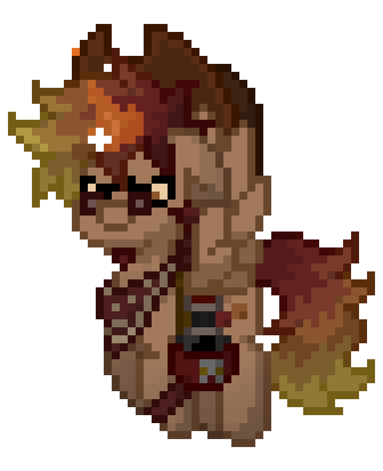

  

<h1 align="center">≥v≥v&ensp;Skippyr Cherrytree 🍒&ensp;≥v≥v</h1>

– Developer Profile –

## ❡ About
<table>
  <tbody>
    <tr>
      <td>
        
I am Sherman Rofeman, also known as "Skippyr Cherrytree". I am an undergraduate software engineer from Brazil that likes My Little Pony and is currently learning Rust & Ruby for the purpose of creating a variety of cross-platform software and systems.

        
Throughout the course of time, I have been developing some projects (which I call "cherries"). Take a look at them by seeing my GitHub pinned projects and don't forget to leave a star if you like one.

      </td>
      <td>
        

           
        

      </td>
    </tr>
  </tbody>
</table>

## ❡ Contact
Get in touch with me by sending me an [e-mail](mailto:skippyr.developer@icloud.com), contributing to one of my projects or finding me while playing [Pony Town](https://pony.town) from time to time.

&ensp;

<strong>≥v≥v&ensp;Here Trot Ponies!&ensp;≥v≥</strong> Made with love by skippyr <3

