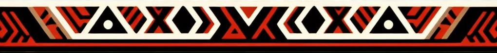

    

<h1 align="center">≥v≥v&ensp;skippyr&ensp;≥v≥v</h1>

GitHub Profile

    
  &nbsp;
    

## ❡ About

Howdy, dragon partners!

I am undergraduate software engineer from Brazil who is interrested in dragons, software design and human-computer interactions.

I have been developing some open-source projects since 2023, most of them consisting of themes, libraries and applications, usually related to the terminal, desktop or the web.

Take a look into my projects: you may end up finding something you like.

## ❡ Contact

Get in touch with me by contributing to one of my active projects or by sending me an [e-mail](mailto:skippyr.developer@gmail.com).

&ensp;

<strong>≥v≥v&ensp;Here Are Dragons!&ensp;≥v≥</strong> Made with love by skippyr <3

